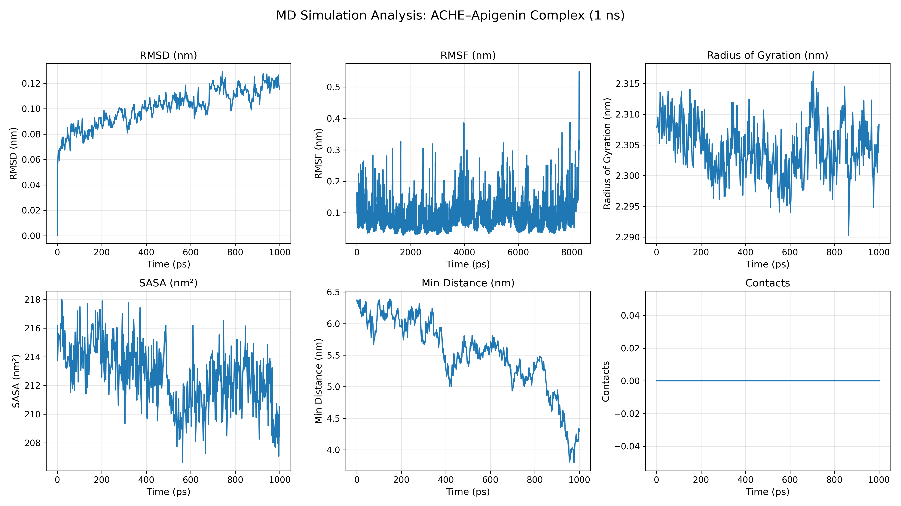

# Molecular Dynamics Simulation of Acetylcholinesterase–Flavonoid Complexes

## Overview

This repository presents a computational investigation of Acetylcholinesterase (AChE) in complex with selected natural flavonoids, including Apigenin, Luteolin, Kaempferol, and Quercetin. Molecular docking and molecular dynamics (MD) simulations were performed to evaluate binding stability, structural flexibility, and protein–ligand interactions.

---

## Research Objective

The primary objective of this study is to investigate the dynamic behavior of AChE–flavonoid complexes and assess their potential as bioactive compounds through computational approaches.

---

## Computational Environment

All molecular dynamics simulations were performed using a command-line computational workflow on macOS. System preparation, topology generation, equilibration, production simulations, and trajectory analyses were executed through terminal-based GROMACS commands without the use of graphical interfaces.

### Core GROMACS Commands Utilized

```bash
gmx pdb2gmx
gmx editconf
gmx solvate
gmx grompp
gmx genion
gmx mdrun
gmx rms
gmx rmsf
gmx gyrate
gmx hbond
```

### Technical Skills Demonstrated

* Molecular Dynamics Simulation
* Protein Structure Preparation
* Protein–Ligand Complex Analysis
* Trajectory Processing and Analysis
* Command-Line Scientific Computing
* Computational Drug Discovery
* Bioinformatics and Molecular Modeling
* GROMACS Workflow Development

### Reproducibility

All simulations were executed using a reproducible terminal-based workflow, enabling transparent and scalable computational analyses suitable for academic and research applications.

---

## Ligands Investigated

* Apigenin
* Luteolin
* Kaempferol
* Quercetin

---

## Computational Workflow

1. Protein Structure Preparation
2. Ligand Preparation
3. Molecular Docking
4. Topology Generation
5. Energy Minimization
6. NVT Equilibration
7. NPT Equilibration
8. Production Molecular Dynamics Simulation
9. Trajectory Analysis
10. Structural Stability Assessment

---

## Software and Tools

* GROMACS 2026.2
* AutoDock Vina
* PyMOL
* BIOVIA Discovery Studio Visualizer

---

## Repository Structure

```text
proteins/      Protein structures and processed files
ligands/       Ligand structures
complexes/     Protein–ligand complexes
scripts/       Simulation and analysis scripts
results/       Analysis outputs
images/        Figures and graphical outputs
```

---

## Representative MD Analysis



---

## Molecular Dynamics Simulation Video

[▶ View Simulation Video](output_progressive_.mp4)

---

## Main Analyses

* Root Mean Square Deviation (RMSD)
* Root Mean Square Fluctuation (RMSF)
* Radius of Gyration (Rg)
* Hydrogen Bond Analysis
* Protein–Ligand Stability Assessment

---

## Research Significance

Understanding the dynamic interactions between Acetylcholinesterase and naturally occurring flavonoids may contribute to the identification of potential neuroprotective compounds and support computational drug discovery efforts targeting neurodegenerative disorders.

---

## Author

**Rituraj Kumar**


**Research Interests:**
Computational Biology, Molecular Docking, Molecular Dynamics Simulation, Drug Discovery, Pharmacology, Bioinformatics, and Computer-Aided Drug Design (CADD).

---

## License

This project is released under the MIT License.

## Citation
Please cite if you use this project.
